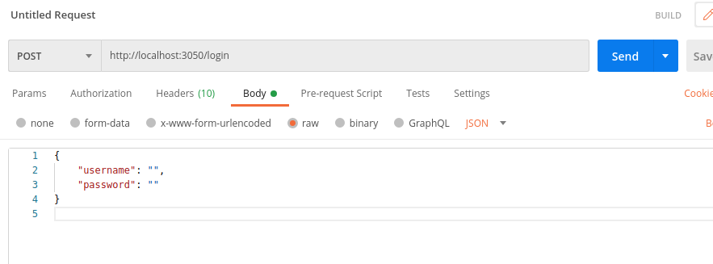
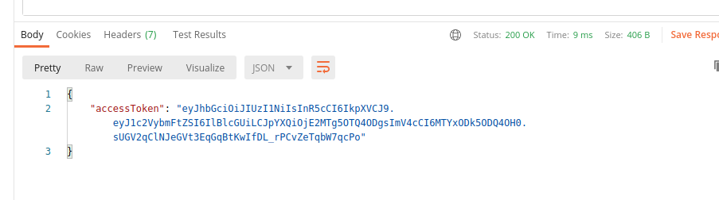
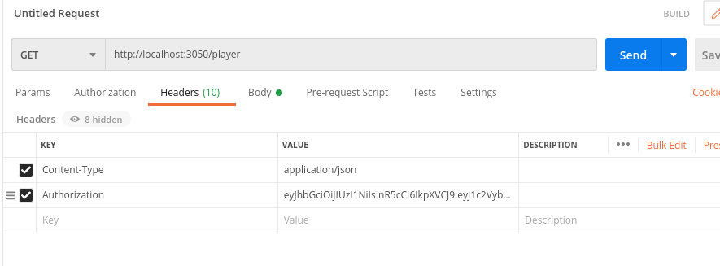

## DB engines
You need to download mysql and mongodb for this to work.
## Download postman
Recommended to test the app.
## Allow root password authorization in MYSQL
If you are trying to access the MYSQL database, you will need to create a user (you will need to remember the root password as well). 
Open a terminal and enter the following while modifying it with your credentials: 
`CREATE USER 'yourUser'@'localhost' IDENTIFIED BY 'yourPassword';` 
`GRANT ALL PRIVILEGES ON * . * TO 'yourUser'@'localhost';`
## Create mysql database
To create the tables and stored procedures in the MYSQL database, run: 
`mysql -u yourUser -p < ./src/models/mysql-creation-scripts`
## Environment variables
There is a .env_example with the names of the environment variables the app will use. Create a new .env in the root folder with those names and fill the values that correspond to those of your machine.
## JWT Authorization
To gain authorization you need to login at the public endpoint. There is no user handling in this app. If you want to change the username and password with which to generate the JWT token, you will find them in `./src/auth/authRoutes.js`.

After loggin in, the app will return the access token: 

Add it to the Authorization header like so:

And now you will be able to access all the private endpoints.
## Run the app
To run the app you will need to run first: 
`npm install` 
And then either  
`npm run mysql` 
or 
`npm run mongodb` 
Depending on which kind of database you want to use.